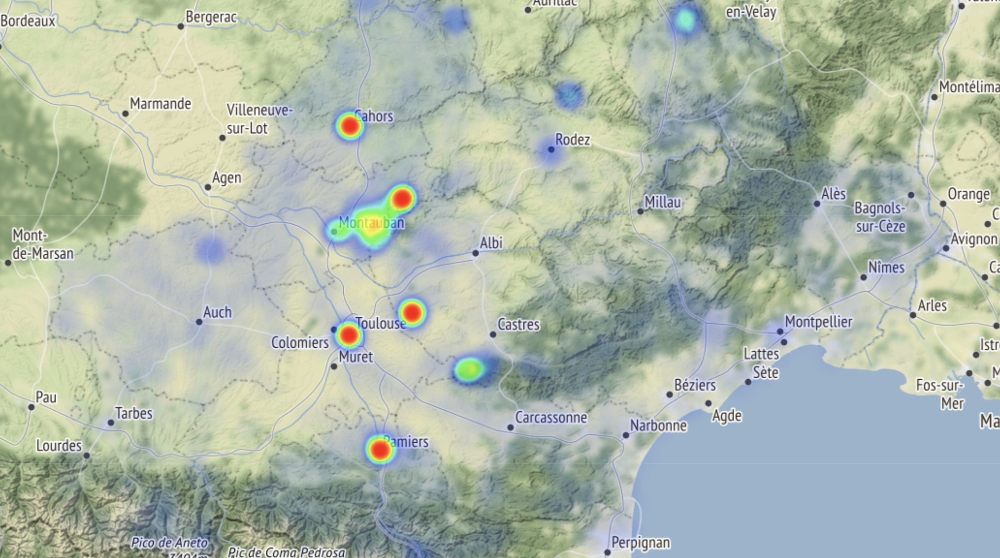

# Inventory records of cultural heritage of the French region Occitanie

Analysis and visualization of inventory records of cultural heritage of the French region Occitanie provided as open data on the [data gouv website](https://www.data.gouv.fr/fr/datasets/5bfdeafa9ce2e70269bea587/)
Data are stored as a table with [GeoPandas](http://geopandas.org/)
A 2D visualization of inventory locations is realized with [ipyleaflet](https://ipyleaflet.readthedocs.io/en/latest/)

Example: display all records as a heatmap

## Running the tests

Run occitanie-inventory-map.ipynb

## Built With

* [GeoPandas](http://geopandas.org/) - GeoPandas is an open source project which extends the datatypes used by pandas to allow spatial operations on geometric types. 
* [ipyleaflet](https://ipyleaflet.readthedocs.io/en/latest/) - Interactive maps in the Jupyter notebook

## Authors

* **Thomas Dubot** 

## License

This project is licensed under the MIT License - see the [LICENSE.md](LICENSE.md) file for details

## Acknowledgments

Inventory records are provided by [data gouv website](https://www.data.gouv.fr/fr/datasets/5bfdeafa9ce2e70269bea587/)

